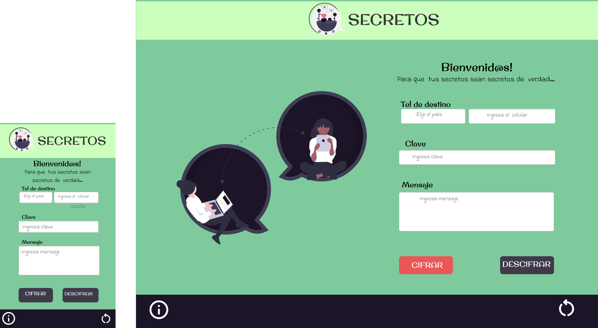

# **_SECRETOS_**

## ¿Quiénes son los principales usuarios de producto?

Cualquier persona que quiera compartir secretos con sus amigos y amigas

## ¿Cuáles son los objetivos de estos usuarios en relación con tu producto?

Encriptar mensajes atraves de la app que estamos creando para enviarlos por sus redes sociales (whatsapp)

## ¿Cómo crees que el producto que estás creando está resolviendo sus problemas?

Por que se esta facilitando la comunicacion entre mujeres en un lenguaje cifrado que solo ellas entenderan

## *Prototipo de alta fidelidad desktop y responsibe mobile*

[DEMO](https://tatiroa994.github.io/BOG002-cipher/)

*********

# Objetivos de aprendizaje

Trabajando en parejas aprenderán a construir una aplicación web que interactuará
con lx usuarix final a través del navegador, utilizando HTML, CSS y JavaScript
como tecnologías.

### HTML y CSS

- [x] Uso de HTML semántico.
- [x] Uso de selectores de CSS.
- [x] Construir tu aplicación respetando el diseño realizado (maquetación).

### DOM

- [x] Uso de selectores del DOM.
- [x] Manejo de eventos del DOM.
- [x] Manipulación dinámica del DOM
      (appendChild |createElement | createTextNode| innerHTML | textContent | etc.)

### JavaScript

- [x] Manipulación de strings.
- [x] Uso de condicionales (if-else | switch | operador ternario)
- [x] Uso de bucles (for | for..in | for..of | while)
- [x] Uso de funciones (parámetros | argumentos | valor de retorno)
- [x] Declaración correcta de variables (const & let)

### Testing

- [x] Testeo unitario.

### Estructura del código y guía de estilo

- [x] Organizar y dividir el código en módulos (Modularización)
- [] Uso de identificadores descriptivos (Nomenclatura | Semántica)
- [x] Uso de linter (ESLINT)

### Git y GitHub

- [x] Uso de comandos de git (add | commit | pull | status | push)
- [x] Manejo de repositorios de GitHub (clone | fork | gh-pages)

### UX

- [x] Diseñar la aplicación pensando y entendiendo al usuario.
- [x] Crear prototipos para obtener feedback e iterar.
- [x] Aplicar los principios de diseño visual (contraste, alineación, jerarquía)

